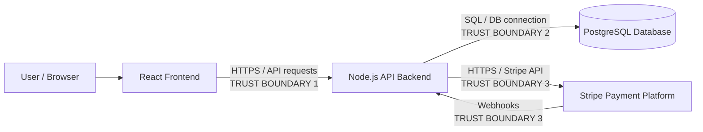

# E-commerce Platform Threat Model

## 1. STRIDE Threats for the Checkout Process

| STRIDE Category | Threat | Attack Scenario | Potential Impact | Likelihood | Suggested Mitigation |
|---|---|---|---|---|---|
| **Tampering** | Client-side price manipulation | An attacker modifies the checkout API request in Burp Suite or browser DevTools, changing a product price from `€100` to `€1` before sending it to the backend. | Financial loss, fraudulent purchases, incorrect accounting records. | **High** if the backend trusts values supplied by the frontend. | Never accept prices or discounts from the client as authoritative. Send only product IDs and quantities, then retrieve the current price from PostgreSQL and calculate the total **server-side** before creating the Stripe payment. |
| **Spoofing** | Stolen or hijacked authenticated session | An attacker obtains another user's session token through token theft, malware, XSS, or another compromise and submits an order while impersonating that customer. | Unauthorized purchases, exposure of customer information, fraudulent orders and reputational damage. | **Medium** with properly implemented authentication; higher if sessions are poorly protected. | Use secure `HttpOnly`, `Secure`, `SameSite` cookies, short-lived sessions/tokens, session invalidation after password changes, MFA where appropriate, and re-authentication for sensitive account changes. |
| **Information Disclosure** | Exposure of payment or checkout information | An attacker intercepts checkout traffic because TLS is missing/misconfigured, or sensitive card information is unnecessarily sent through or logged by the Node.js backend. | Exposure of payment/customer data, regulatory consequences, fraud and reputational damage. | **Low–Medium** when Stripe is integrated correctly; significantly higher if raw payment data passes through the application. | Enforce HTTPS/TLS, use Stripe Elements/Checkout and tokenization so card details go directly to Stripe, never log card data, and restrict sensitive information returned by API responses. |

### Important Checkout Principle

The **React frontend must never be considered trusted**.

For example, a request such as:

```json
{
  "productId": 123,
  "quantity": 1,
  "price": 1.00
}
```

should not result in the backend accepting `price: 1.00`.

Instead:

```text
Product ID → Backend → Database → Trusted price
                           ↓
                    Calculate total
                           ↓
                         Stripe
```

The backend should determine the amount independently.

---

## 2. Trust Boundaries

A **trust boundary** exists whenever data moves between components with different levels of trust or security control.

### Architecture / Trust Boundary Diagram



### Trust Boundary 1 — Browser / React Frontend → Node.js API

The user's browser is **untrusted**, while the backend is part of the controlled application environment.

An attacker controls virtually everything sent from their browser, including:

- Product IDs
- Quantities
- Prices
- HTTP headers
- Cookies/tokens they legitimately possess
- API requests
- JavaScript requests

Therefore, validation implemented only in React provides **no security guarantee**.

The Node.js API must independently perform:

- Authentication
- Authorization
- Input validation
- Price calculation
- Business-rule validation

This is one of the most important trust boundaries in the architecture.

### Trust Boundary 2 — Node.js Backend → PostgreSQL

The application server crosses another boundary when communicating with the database.

For example:

```text
User search:

"laptop"

Browser
   ↓
Node.js API
   ↓
PostgreSQL
```

If untrusted input is directly inserted into SQL:

```javascript
"SELECT * FROM products WHERE name LIKE '%" + search + "%'"
```

an attacker may manipulate the query.

Controls should include:

- Parameterized queries / prepared statements
- Restricted database accounts
- Input validation
- Database network restrictions
- No direct public access to PostgreSQL

### Trust Boundary 3 — Node.js Backend ↔ Stripe

Stripe is an **external third-party system** outside the application's infrastructure.

Two directions must therefore be protected:

```text
Backend → Stripe API
Stripe → Backend webhook
```

The application should:

- Communicate using TLS
- Protect Stripe API secrets
- Never expose secret API keys to React
- Validate Stripe webhook signatures
- Verify payment status server-side
- Never trust a frontend claim such as `"paymentSuccessful": true`

For example, the backend should verify the payment with Stripe before changing:

```text
Order status:
PENDING → PAID
```

### Additional Logical Trust Boundary — Anonymous → Authenticated

There is also an important authorization boundary within the application:

```text
Anonymous
├── Browse products
└── Add to cart

Authenticated
├── Checkout
├── Pay
└── View order history
```

A user should not be able to bypass this simply by calling:

```http
POST /api/checkout
```

directly instead of using the React interface.

Authentication and authorization therefore have to be enforced by the **API**, not merely by hiding checkout pages in React.

---

## 3. DREAD — SQL Injection in Product Search

Assumption: the product-search endpoint is publicly accessible without authentication and contains an exploitable SQL injection vulnerability.

DREAD evaluates:

| Factor | Meaning |
|---|---|
| **D** | Damage Potential |
| **R** | Reproducibility |
| **E** | Exploitability |
| **A** | Affected Users |
| **D** | Discoverability |

Using a **1–10 scale**:

\[
DREAD = \frac{Damage + Reproducibility + Exploitability + AffectedUsers + Discoverability}{5}
\]

### Assessment

| DREAD Factor | Score | Reasoning |
|---|---:|---|
| **Damage Potential** | **9/10** | Successful SQL injection could expose product, account or order data and, depending on database privileges, potentially modify or delete information. |
| **Reproducibility** | **9/10** | Once a working injection payload is identified, the attack can generally be repeated reliably against the same endpoint. |
| **Exploitability** | **8/10** | Product search is available without authentication. Attackers only require HTTP access and common techniques or tools such as Burp Suite or sqlmap. |
| **Affected Users** | **9/10** | If the vulnerable database contains shared customer/order information, compromise could affect a significant proportion of customers rather than only the attacker. |
| **Discoverability** | **10/10** | Search functionality is publicly visible and easy to identify. Automated scanners routinely test URL parameters and API inputs for SQL injection. |

### Calculation

\[
DREAD = \frac{9+9+8+9+10}{5}
\]

\[
DREAD = \frac{45}{5}
\]

\[
\boxed{DREAD = 9.0/10}
\]

### Risk Rating: **Critical**

The particularly high score is caused by the combination of an **internet-accessible, unauthenticated attack surface** and potentially severe database compromise.

### Example Attack Scenario

Suppose the search endpoint accepts:

```http
GET /api/products?search=laptop
```

and the backend constructs:

```sql
SELECT *
FROM products
WHERE name LIKE '%laptop%';
```

If the application concatenates input directly, an attacker could provide specially crafted SQL syntax that alters the intended query.

The problem is fundamentally:

```text
Untrusted user input
        ↓
Application constructs SQL
        ↓
Database interprets attacker input as SQL
```

### Mitigation

The primary control is **parameterized SQL queries**.

For example:

```javascript
const result = await db.query(
    "SELECT * FROM products WHERE name ILIKE $1",
    [`%${searchTerm}%`]
);
```

Additional controls should include:

- Run Node.js using a **least-privilege PostgreSQL account**.
- Do not allow the application database user administrative privileges.
- Validate acceptable search-input length and format.
- Prevent PostgreSQL from being directly reachable from the Internet.
- Monitor repeated malformed search requests and SQL errors.
- Avoid returning raw database errors to users.

These controls are relatively inexpensive to implement compared with the potential cost of a database breach, making remediation a **high-priority development task**.
