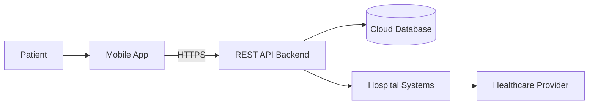

# Healthcare Mobile App Threat Model

## 1. Most Critical Asset — Patient Health Information

The most critical asset is **patient health information**, including:

- Medical records
- Diagnoses and treatment history
- Prescription information
- Provider messages
- Appointment information
- Personally identifiable information linked to healthcare data

Healthcare data is especially sensitive because a compromise can affect not only privacy, but also patient safety and the reliability of clinical decisions.

### CIA Triad Analysis

| CIA Component | Importance | Reasoning |
|---|---|---|
| **Confidentiality** | **Critical** | Medical records and provider communications contain highly sensitive personal information. Unauthorized disclosure can cause privacy violations, identity theft, reputational harm, and regulatory consequences. |
| **Integrity** | **Critical** | Medical information must remain accurate. If an attacker modifies prescriptions, allergies, diagnoses, or provider messages, healthcare staff could make decisions using false information and directly endanger a patient. |
| **Availability** | **High** | Patients and healthcare providers need reliable access to records, messages, appointments, and prescription services. An outage could delay treatment or prevent timely access to important information. |

### Conclusion

Although all three CIA properties are important, **confidentiality and integrity are particularly critical**.

A confidentiality breach exposes sensitive patient information, while an integrity breach can be even more dangerous because manipulated medical information may affect real clinical decisions.

```text
Patient Health Information
        │
        ├── Confidentiality → Prevent unauthorized disclosure
        │
        ├── Integrity       → Prevent unauthorized modification
        │
        └── Availability    → Ensure legitimate access when needed
```

---

## 2. STRIDE Threats — "Message Healthcare Providers"

The messaging feature allows sensitive information to move between patients, the mobile application, the REST API, the database, and healthcare-provider systems.

### Simplified Message Flow



### STRIDE Analysis

| STRIDE Category | Threat Description | Attack Scenario | Impact | Likelihood | Mitigation |
|---|---|---|---|---|---|
| **Spoofing** | An attacker impersonates a patient or healthcare provider. | An attacker steals a patient's authentication token and sends messages to a doctor using the victim's account. Alternatively, a compromised provider account could be used to send fraudulent medical instructions to patients. | Unauthorized disclosure of patient information, fraudulent medical requests, social engineering, and possible patient harm. | **Medium–High** because stolen credentials and session tokens are common attack paths. | Require strong authentication, MFA for sensitive accounts, short-lived access tokens, secure token storage using iOS Keychain/Android Keystore, session revocation, and re-authentication for high-risk actions. |
| **Tampering** | Messages are modified before they reach the intended recipient or while stored. | An attacker exploits an API or backend vulnerability and changes a provider message from `"Take 1 tablet daily"` to `"Take 3 tablets daily"`. | Incorrect medical instructions, patient harm, loss of trust, and legal or regulatory consequences. | **Medium** if authorization or backend integrity controls are weak. | Enforce TLS, validate all API requests, use strict authorization checks, protect database write access, maintain message version/history data, and generate integrity-protected audit records. |
| **Repudiation** | A patient or provider denies sending or receiving a message. | A provider sends treatment advice through the application but later disputes having sent it. Without reliable audit records, the organization cannot prove which authenticated account performed the action. | Legal disputes, weak incident investigations, compliance problems, and inability to reconstruct clinical communication. | **Medium** because disputes or account misuse cannot be reliably investigated without audit evidence. | Record authenticated user ID, timestamp, message ID, relevant action, and delivery status in tamper-resistant audit logs. Synchronize system time and restrict access to audit data. |
| **Information Disclosure** | Unauthorized users gain access to private patient-provider messages. | An API authorization flaw allows Patient A to change a message ID in a request and retrieve Patient B's conversation. Another possibility is sensitive message content being exposed through application logs or push notifications. | Exposure of protected health information, privacy violations, regulatory penalties, identity theft, and reputational damage. | **High** because messaging contains sensitive health information and broken access control is a major application risk. | Enforce object-level authorization on every message request, encrypt data in transit and at rest, minimize sensitive notification content, prevent PHI from entering debug logs, and restrict database access. |
| **Denial of Service** | Attackers prevent patients or providers from using the messaging service. | An attacker floods the messaging API with requests, exhausting backend resources and preventing legitimate users from sending or receiving messages. | Delayed communication, disruption of care coordination, reduced service availability, and increased support workload. | **Medium** for an Internet-facing API without appropriate rate limiting and capacity controls. | Apply API rate limiting, request quotas, autoscaling where appropriate, load balancing, traffic monitoring, and upstream DDoS protection. |
| **Elevation of Privilege** | A normal user gains provider or administrative privileges. | A patient manipulates an API request or exploits an authorization flaw to access provider-only messaging functions or conversations belonging to other users. | Broad exposure of patient data, unauthorized medical communication, account compromise, and potentially large-scale data modification. | **Medium** if role enforcement is incomplete or performed only in the mobile client. | Enforce role-based authorization exclusively on the backend, use deny-by-default permissions, validate resource ownership on every request, separate administrative interfaces, and regularly test authorization rules. |

### Important Messaging Principle

The **mobile client must not be trusted to enforce authorization**.

For example, hiding a provider-only button in the app does not prevent a patient from manually sending the underlying API request.

```text
Mobile client request
        ↓
REST API
        ↓
Authenticate identity
        ↓
Check role + resource ownership
        ↓
Allow or deny operation
```

Every messaging operation must therefore be authorized by the backend.

---

## 3. Prioritized Security Controls for Patient Data

The following controls are prioritized according to how directly they reduce the risk of unauthorized access, disclosure, or modification of patient information.

| Priority | Security Control | Why It Is Important | Specific Implementation |
|---:|---|---|---|
| **1** | **Strong Authentication and Session Security** | If attackers can take over patient or provider accounts, most other application controls can be bypassed using apparently legitimate access. | Use MFA for healthcare-provider and administrative accounts, strong password policies, short-lived tokens, refresh-token rotation, session revocation, brute-force protection, and secure mobile token storage using iOS Keychain or Android Keystore. |
| **2** | **Server-Side Authorization / Least Privilege** | An authenticated user must only access the records, conversations, prescriptions, and appointments they are authorized to use. | Enforce role-based and object-level authorization in the REST API. Verify both the authenticated identity and ownership/clinical relationship for every sensitive request. Use deny-by-default permissions. |
| **3** | **Encryption in Transit and at Rest** | Patient information moves between mobile devices, cloud infrastructure, and hospital systems and must be protected from interception or infrastructure compromise. | Require TLS for all external and internal API communication, encrypt databases and backups at rest, manage keys through a dedicated cloud key-management service, rotate keys, and never store encryption secrets in the mobile application. |
| **4** | **Tamper-Resistant Audit Logging and Monitoring** | Healthcare organizations need to identify suspicious access and reconstruct who accessed or changed sensitive information. | Log authentication events, record access, message activity, prescription actions, authorization failures, and administrative changes. Centralize logs, restrict modification, alert on anomalous access patterns, and define retention requirements. |
| **5** | **Secure API and Data Validation Controls** | The REST API is the central gateway to patient data and hospital integrations. Injection, broken object access, mass assignment, or malformed requests could expose or modify records. | Use strict schema validation, parameterized database queries, allowlists for accepted fields, API rate limiting, safe error handling, dependency patching, automated security testing, and regular authorization tests. |

### Priority Rationale

The controls are ordered around one central objective:

```text
1. Verify WHO the user is
           ↓
2. Verify WHAT they may access
           ↓
3. Protect the DATA while stored/transmitted
           ↓
4. Record and DETECT suspicious activity
           ↓
5. Harden the API against technical attacks
```

### Real-World Implementation Considerations

A healthcare organization may have limited development time, legacy hospital systems, and strict availability requirements. The controls should therefore be implemented in phases.

**Immediate priorities:**

- Strong authentication
- Backend authorization
- TLS everywhere
- Secure storage of authentication tokens
- Protection of patient data in logs

**Next phase:**

- Centralized audit logging and alerting
- Encryption-key lifecycle management
- API rate limiting
- Automated authorization and security tests
- Security reviews of hospital-system integrations

The first three controls provide the largest immediate reduction in risk because they directly prevent unauthorized users from reaching sensitive patient information.
