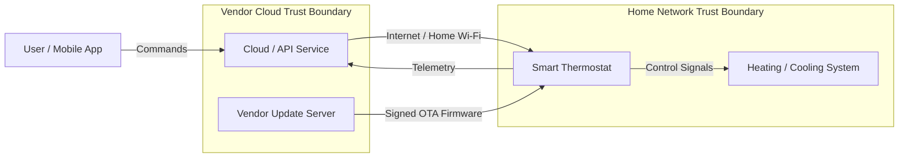
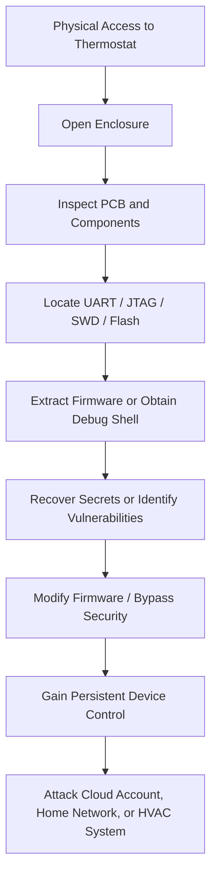
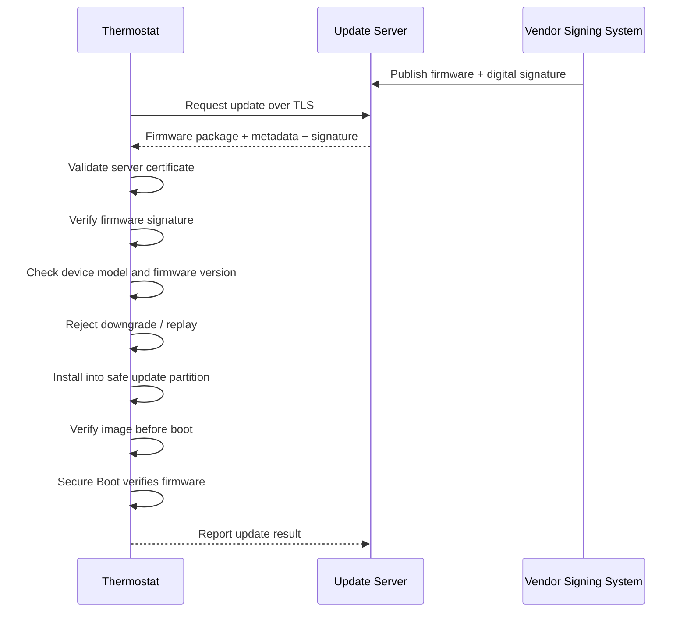

# IoT Smart Thermostat Threat Model

## System Overview

The smart thermostat is an Internet of Things (IoT) device that connects to a home Wi-Fi network, controls heating and cooling equipment, collects environmental data, receives commands from a mobile application, and installs firmware updates over the air (OTA).

### Simplified Architecture

The most important trust boundaries are between the physical device and its local environment, the thermostat and the home Wi-Fi network, and the device and vendor-controlled cloud/update infrastructure.

---

## 1. IoT-Specific Threats

IoT devices face several threats that are less common or less significant for traditional web applications because they combine software, network connectivity, embedded hardware, and physical deployment.

| # | Threat | Description | Realistic Attack Scenario | Impact | Likelihood | Mitigation |
|---|---|---|---|---|---|---|
| 1 | Physical tampering | An attacker can directly access the hardware, casing, circuit board, storage, or sensors. | An attacker removes the thermostat from the wall, opens the enclosure, and accesses internal components or exposed test pads. | Device compromise, credential theft, firmware modification, loss of heating/cooling control. | Medium | Use tamper-resistant enclosure design, disable unused debug interfaces, encrypt sensitive data at rest, and implement secure boot. |
| 2 | Exposed debug interfaces | Embedded devices may expose UART, JTAG, SWD, or other maintenance interfaces. | An attacker connects to an exposed UART/JTAG interface and obtains a privileged shell or reads flash memory. | Full device compromise, firmware extraction, secret recovery, bypass of authentication controls. | Medium | Disable or lock production debug interfaces, require authenticated debugging, remove test headers where possible, and enable hardware readout protection. |
| 3 | Firmware extraction and reverse engineering | Firmware is often stored locally and may be copied from flash memory or update packages. | An attacker extracts the firmware and searches it for API keys, Wi-Fi credentials, hard-coded passwords, cryptographic keys, or vulnerabilities. | Exposure of secrets, creation of exploits, compromise of many identical devices. | High | Encrypt sensitive secrets, avoid hard-coded credentials, use hardware-backed key storage, strip unnecessary debugging information, and protect firmware images. |
| 4 | Weak or shared default credentials | IoT devices are sometimes shipped with predictable or identical factory credentials. | An attacker scans the local network or Internet for thermostats and logs in using known vendor default credentials. | Unauthorized device control, privacy loss, botnet enrollment, network pivoting. | Medium | Require unique per-device credentials, force credential setup during onboarding, support MFA for cloud accounts, and prevent unchanged default passwords. |
| 5 | Insecure local network communication | Device traffic may use weak authentication or encryption on the home network. | An attacker connected to the same Wi-Fi network intercepts or modifies thermostat commands and telemetry. | Manipulation of temperature settings, information disclosure, session hijacking. | Medium | Use TLS with certificate validation, mutual authentication where practical, secure session tokens, and protect local APIs against replay attacks. |
| 6 | Malicious or vulnerable firmware updates | A compromised OTA process can install attacker-controlled firmware. | An attacker performs a man-in-the-middle attack or compromises the update server and delivers a modified firmware image. | Persistent full-device compromise, botnet enrollment, safety or availability impact. | Medium | Require cryptographically signed firmware, verify signatures on-device, use TLS, secure boot, version validation, and rollback protection. |
| 7 | Sensor manipulation | Physical sensors can be influenced without directly compromising the software. | An attacker heats or cools the thermostat sensor artificially so that the device reports a false temperature. | Incorrect HVAC operation, energy waste, discomfort, possible equipment stress. | Low to Medium | Validate sensor ranges, detect implausible changes, use secondary sensors where justified, and generate alerts for abnormal measurements. |

### Key Observation

The main difference from a standard web application is that the thermostat can be attacked **physically as well as remotely**. If the same hardware and firmware are deployed to thousands of customers, one successfully extracted firmware image may also help an attacker develop exploits that scale across the entire product fleet.

---

## 2. Physical Access Attack Chain

If an attacker gains physical access to the thermostat, the attack can progress from hardware inspection to complete device compromise.

### Attack Chain

### Step-by-Step Analysis

1. **Device disassembly**  
   The attacker removes the thermostat from the wall and opens the enclosure to access the printed circuit board.

2. **Hardware reconnaissance**  
   The attacker identifies the microcontroller, flash memory, test pads, serial interfaces, and debug ports such as UART, JTAG, or SWD.

3. **Debug or memory access**  
   If debug protection is not enabled, the attacker may obtain a console or dump the device's flash memory.

4. **Firmware and secret extraction**  
   The attacker analyzes the firmware for credentials, cryptographic keys, Wi-Fi information, cloud API tokens, undocumented commands, or vulnerable software components.

5. **Security bypass**  
   Extracted firmware may be modified to disable authentication, certificate validation, logging, or update checks.

6. **Persistent compromise**  
   If the boot process does not verify firmware integrity, the attacker can install malicious firmware that survives reboots.

7. **Expansion of access**  
   The compromised thermostat may then be used to attack cloud services, communicate with other devices on the home network, or manipulate the HVAC system.

### Potential Impacts

- **Confidentiality:** Exposure of Wi-Fi credentials, cloud tokens, device identifiers, temperature history, occupancy patterns, or cryptographic keys.
- **Integrity:** Unauthorized modification of temperature settings, sensor readings, firmware, or device configuration.
- **Availability:** Device bricking, forced heating/cooling shutdown, repeated rebooting, or denial of service.
- **Safety and operational impact:** Extreme heating or cooling settings could create uncomfortable or potentially unsafe indoor conditions.
- **Lateral movement:** A compromised thermostat may become a foothold for attacking other systems on the home network.
- **Fleet-wide compromise:** Extracted secrets or firmware vulnerabilities may affect many devices if all units share the same design or credentials.

### Physical Access Mitigations

- Disable or permanently lock debug interfaces in production.
- Enable microcontroller flash/readout protection.
- Store private keys in a secure element or hardware-backed keystore.
- Use encrypted storage for sensitive secrets.
- Enforce secure boot with a hardware root of trust.
- Use tamper-evident or tamper-resistant enclosure design where cost permits.
- Avoid shared secrets across the entire device fleet.
- Ensure physical compromise of one thermostat does not reveal credentials that work on other devices.

---

## 3. Security Controls for OTA Firmware Updates

The OTA update mechanism is security-critical because it has the ability to replace software running with high privileges on the device.

### Secure OTA Update Flow

### Essential Security Requirements

| Priority | Security Requirement | Why It Is Essential | Specific Control |
|---|---|---|---|
| 1 | Cryptographic firmware signing | The thermostat must distinguish legitimate vendor firmware from attacker-modified firmware. | Sign every firmware image with a vendor-controlled private key and verify the digital signature on the device before installation. |
| 2 | Secure boot | Firmware validation must continue after installation and on every reboot. | Configure the bootloader to execute only firmware signed by an approved vendor key anchored in hardware or protected immutable storage. |
| 3 | Secure transport | Update files and metadata must be protected while traveling across untrusted networks. | Use modern TLS with strict certificate validation; reject invalid, expired, or untrusted certificates. |
| 4 | Rollback protection | Attackers must not be able to reinstall an older firmware version containing known vulnerabilities. | Store a protected minimum firmware/security version counter and reject versions below it. |
| 5 | Anti-replay protection | A previously valid update package should not be reusable in an unsafe context. | Validate signed version numbers, timestamps or monotonic counters, device model, and update metadata. |
| 6 | Update integrity verification | Corruption must be detected before installation. | Verify the firmware signature and cryptographic hash before activation. |
| 7 | Device compatibility validation | Firmware for one hardware model must not be installed on another. | Include signed model, hardware revision, and target-device metadata in the update manifest. |
| 8 | Failure-safe update mechanism | Power loss or update failure must not permanently disable the thermostat. | Use A/B partitions or a recovery image so the device can automatically revert to the last known-good firmware. |
| 9 | Signing-key protection | Compromise of the vendor signing key could compromise the entire device fleet. | Store signing keys in an HSM, restrict access, require separation of duties, and maintain key rotation/revocation procedures. |
| 10 | Update logging and monitoring | Failed or abnormal updates can indicate attacks or operational problems. | Log update attempts, version changes, signature failures, and rollback events locally and/or in the vendor backend. |

### OTA Security Principles

A secure OTA process should guarantee:

- **Authenticity:** The update was produced by the legitimate vendor.
- **Integrity:** The firmware has not been modified.
- **Confidentiality:** Update transport and sensitive metadata are protected where necessary.
- **Authorization:** Only approved firmware may be installed.
- **Freshness:** Old or replayed updates are rejected.
- **Availability:** A failed update must not permanently brick the device.
- **Recoverability:** The device can return to a known-good firmware version after an installation failure.
- **Auditability:** Update activity can be reviewed during incident response.

### Real-World Implementation Priorities

For a cost-sensitive consumer thermostat, the highest-value controls are:

1. Hardware-backed secure boot.
2. Signed firmware verified on-device.
3. TLS-protected update delivery.
4. Rollback protection.
5. A/B firmware partitions or a protected recovery image.
6. Secure vendor signing-key management.

These controls provide strong protection without requiring expensive security hardware in every component. A small secure element or microcontroller with hardware key storage can significantly improve resistance to physical extraction while keeping production costs manageable.

---

## Conclusion

The thermostat's main security challenge is that it combines a remotely accessible networked service with a physically accessible embedded device. Physical access can expose firmware, secrets, and debug interfaces, while an insecure OTA mechanism could allow attackers to compromise large numbers of devices simultaneously.

The most important design principle is therefore to ensure that **a compromise of communication channels, local storage, or a single physical device cannot bypass the chain of trust used to verify firmware and device identity**.
