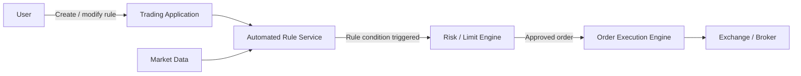
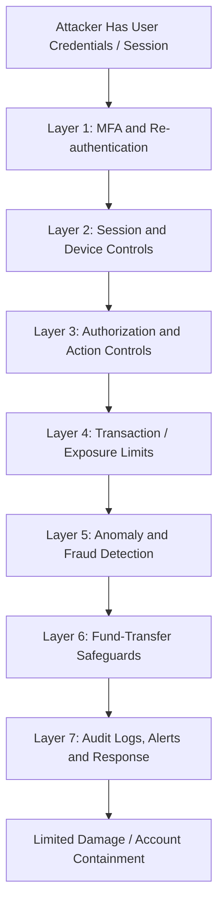

# Financial Trading Platform Threat Model

## 1. CIA Priority and Security vs. Performance

A financial trading platform depends on all three elements of the **CIA Triad**, but **integrity is the most critical component**.

### CIA Triad Analysis

| CIA Component | Importance | Reasoning |
|---|---|---|
| **Integrity** | **Critical** | Orders, balances, market data, account details, and automated trading rules must remain accurate and authorized. A small unauthorized modification could cause incorrect trades, financial loss, market exposure, regulatory violations, or disputes over transactions. |
| **Availability** | **Critical** | The platform requires **99.99% uptime**. An outage can prevent users from entering or cancelling orders during volatile market conditions and can create direct financial and operational impact. |
| **Confidentiality** | **High** | Account data, balances, positions, trading strategies, authentication data, and personal information must be protected from unauthorized disclosure. |

### Most Critical Component: Integrity

In a trading system, incorrect data can be more dangerous than unavailable data.

For example:

```text
Correct order:
Buy 10 shares at €100

Manipulated order:
Buy 1,000 shares at €100
```

The system may remain fully available and respond within the required latency, but it would still be unsafe because the executed transaction is incorrect.

A loss of integrity could affect:

- Order quantities or prices
- Account balances
- Fund transfers
- Automated trading rules
- Market-price data
- Transaction history
- Risk and exposure calculations

For this reason, **integrity should be treated as the highest security priority**, with availability immediately behind it.

### Can Security Requirements Conflict with Performance Requirements?

**Yes.** Some security controls introduce additional processing, network round trips, or storage operations that can increase latency.

| Security Control | Possible Performance Impact | Practical Approach |
|---|---|---|
| TLS encryption | Encryption/decryption consumes CPU time. | Use modern TLS, connection reuse, optimized cryptographic libraries, and hardware acceleration where justified. |
| MFA / step-up authentication | Additional interaction can delay sensitive actions. | Authenticate strongly before the trading session and reserve step-up authentication for high-risk actions such as changing bank details or disabling safeguards. |
| Fraud and anomaly detection | Complex checks may delay order processing. | Perform essential deterministic controls synchronously and move heavier behavioral analytics to a parallel or near-real-time monitoring path. |
| Audit logging | Synchronous log writes can increase response time. | Use durable queues or high-performance append-only logging so order execution does not depend on slow downstream log processing. |
| Authorization and risk checks | Every order requires additional validation. | Keep authorization and limit checks local, cached where safe, deterministic, and optimized for predictable execution time. |

The objective is therefore not to remove security controls for speed, but to **design controls that protect transaction integrity while remaining compatible with the <100 ms trade-latency requirement**.

```text
Security                         Performance
   │                                 │
   │   Strong validation             │   <100 ms trades
   │   Authentication                │   High throughput
   │   Auditability                  │   99.99% uptime
   │                                 │
   └──────────── Balanced design ────┘
```

---

## 2. Threat Model — Automated Trading Rules

Automated trading rules are particularly sensitive because a single rule can repeatedly create orders without requiring manual confirmation for every transaction.

### Simplified Automated Trading Flow



The most important principle is that a triggered rule must **never bypass the same authorization, validation, and risk controls applied to a manually submitted order**.

### Top Three Risks

| Risk | Threat Description | Attack Scenario | Impact | Likelihood | Specific Mitigation |
|---|---|---|---|---|---|
| **1. Unauthorized Rule Modification** | An attacker changes an existing rule or creates a malicious automated rule after compromising a user account or exploiting an authorization weakness. | An attacker gains access to a user's session and changes a rule from `Buy 10 shares when price < €100` to `Buy 10,000 shares when price < €100`. The rule later triggers automatically without further user interaction. | Large unauthorized positions, direct financial loss, account depletion, regulatory investigation, and loss of customer trust. | **High** because account compromise is a realistic attack path and automated rules can amplify the damage. | Require MFA and re-authentication for creating or materially changing automated rules; enforce server-side ownership checks; notify users through an independent channel; maintain immutable rule-change history; allow immediate rule disablement; apply maximum order and exposure limits independent of the rule itself. |
| **2. Logic or Validation Flaws** | Incorrect rule interpretation, insufficient validation, or unsafe combinations of conditions cause trades that the user did not intend. | A rule intended to execute once when a price crosses a threshold is evaluated repeatedly while the condition remains true, causing hundreds of duplicate orders. Another flaw could accept an invalid negative quantity or incorrectly combine AND/OR conditions. | Unexpected trading activity, excessive exposure, financial loss, customer disputes, and operational incidents. | **Medium–High** because complex business logic and edge cases are common sources of software defects. | Use strict server-side schema and semantic validation; define deterministic rule semantics; reject impossible or unsafe values; add unit, integration, property-based, and boundary-condition tests; simulate rules before activation; enforce independent position/notional limits; use staged rollout for major rule-engine changes. |
| **3. Race Conditions / Duplicate Execution** | Concurrent events or retries cause a rule to be evaluated or executed more than once. | Two market-data events arrive almost simultaneously. Both workers see the rule as eligible before either records that it has already fired, resulting in two orders. A network retry could similarly resubmit the same order. | Duplicate trades, unintended positions, increased transaction fees, incorrect balances, and potential cascading losses during volatile markets. | **Medium** because highly concurrent, low-latency systems naturally create race-condition risk if state transitions are not atomic. | Use idempotency keys for generated orders; perform atomic state transitions or compare-and-set operations; serialize execution per rule/account where necessary; deduplicate events; make retries idempotent; enforce order-rate and exposure limits; test concurrency under production-like load. |

### DREAD Risk Scoring

DREAD evaluates five factors on a **1–10 scale**:

| Factor | Meaning |
|---|---|
| **D** | Damage Potential |
| **R** | Reproducibility |
| **E** | Exploitability |
| **A** | Affected Users |
| **D** | Discoverability |

Formula:

\[
DREAD = \frac{Damage + Reproducibility + Exploitability + AffectedUsers + Discoverability}{5}
\]

Suggested interpretation:

- **9.0–10.0:** Critical
- **7.0–8.9:** High
- **4.0–6.9:** Medium
- **1.0–3.9:** Low

#### Risk 1 — Unauthorized Rule Modification

| DREAD Factor | Score | Reasoning |
|---|---:|---|
| Damage Potential | **10/10** | A malicious rule could repeatedly execute large trades or create substantial financial exposure. |
| Reproducibility | **8/10** | Once an attacker controls the account or finds an authorization flaw, malicious rule changes can generally be repeated. |
| Exploitability | **7/10** | Exploitation requires account/session compromise or a rule-management authorization weakness, but neither requires direct access to trading infrastructure. |
| Affected Users | **6/10** | A single compromise may initially affect one account, although shared authorization flaws could affect many users. |
| Discoverability | **7/10** | Rule-management functions are visible to authenticated users and can be tested for weak authorization or insufficient confirmation controls. |

\[
DREAD = \frac{10+8+7+6+7}{5} = \frac{38}{5} = \boxed{7.6/10}
\]

**Risk Rating: High**

#### Risk 2 — Logic or Validation Flaws

| DREAD Factor | Score | Reasoning |
|---|---:|---|
| Damage Potential | **9/10** | A rule-engine defect can generate many unintended trades before a user or monitoring system notices. |
| Reproducibility | **8/10** | A deterministic logic defect is usually repeatable whenever the same rule and market conditions occur. |
| Exploitability | **6/10** | Some flaws require knowledge of specific edge cases or rule combinations rather than simple account access. |
| Affected Users | **7/10** | A defect in shared rule-engine logic can affect multiple customers using the same rule type or condition. |
| Discoverability | **6/10** | Edge cases may be difficult to find, but users and attackers can experiment with supported rule parameters. |

\[
DREAD = \frac{9+8+6+7+6}{5} = \frac{36}{5} = \boxed{7.2/10}
\]

**Risk Rating: High**

#### Risk 3 — Race Conditions / Duplicate Execution

| DREAD Factor | Score | Reasoning |
|---|---:|---|
| Damage Potential | **8/10** | Duplicate execution can create unintended positions and significant losses, especially during volatile trading. |
| Reproducibility | **7/10** | Once the required timing or concurrency condition is understood, the issue may be reproduced through repeated events or requests. |
| Exploitability | **6/10** | Exploitation usually requires carefully timed requests, event bursts, or knowledge of system behavior. |
| Affected Users | **6/10** | A systemic concurrency flaw may affect many users, but individual triggers often affect a specific account or rule. |
| Discoverability | **5/10** | Timing flaws are generally harder to discover than normal input-validation weaknesses. |

\[
DREAD = \frac{8+7+6+6+5}{5} = \frac{32}{5} = \boxed{6.4/10}
\]

**Risk Rating: Medium**

### Risk Priority

| Priority | Risk | DREAD Score | Rating |
|---:|---|---:|---|
| **1** | Unauthorized rule modification | **7.6/10** | **High** |
| **2** | Logic or validation flaws | **7.2/10** | **High** |
| **3** | Race conditions / duplicate execution | **6.4/10** | **Medium** |

---

## 3. Defense in Depth After User Account Compromise

If an attacker successfully obtains a user's credentials or active session, the platform should assume that **authentication has already failed**. Additional controls must prevent the compromised account from immediately causing unlimited financial damage.

### Defense-in-Depth Model



### Security Layers

| Layer | Security Control | How It Limits Damage After Account Compromise |
|---:|---|---|
| **1** | **MFA and Step-Up Authentication** | Require phishing-resistant MFA where possible and require fresh authentication for high-risk actions such as adding withdrawal accounts, changing security settings, creating unusually powerful automated rules, or initiating large transfers. Stolen passwords alone should therefore be insufficient. |
| **2** | **Session and Device Security** | Use short-lived sessions, refresh-token rotation, secure cookies/tokens, device binding or trusted-device signals, session revocation, concurrent-session controls, and immediate invalidation after password/security changes. Suspicious new-device sessions can be restricted or challenged. |
| **3** | **Server-Side Authorization and Sensitive-Action Controls** | Enforce authorization for every order, rule change, account setting, and fund transfer. Require stronger verification for security-sensitive changes and prevent one compromised account from accessing other customers or administrative functions. |
| **4** | **Transaction, Position, and Exposure Limits** | Apply independent per-order, daily notional, position, leverage, loss, and order-rate limits. Automated rules must not be able to override these limits. Circuit breakers can pause trading when abnormal loss or activity thresholds are reached. |
| **5** | **Anomaly / Fraud Detection** | Detect unusual login locations, new devices, abnormal trade sizes, rapid rule changes, unusual order frequency, sudden liquidation, or behavior inconsistent with the account's normal history. High-risk activity can trigger step-up authentication, temporary restrictions, or analyst review. |
| **6** | **Fund-Transfer Safeguards** | Use beneficiary allowlists, cooling-off periods for newly added withdrawal destinations, transfer limits, confirmation through an independent channel, and enhanced verification for large or unusual withdrawals. This prevents an attacker from immediately moving stolen funds outside the platform. |
| **7** | **Tamper-Resistant Audit Trails and Real-Time Alerts** | Record logins, session creation, trades, rule changes, transfer actions, limit changes, and security-setting changes with synchronized timestamps and protected logs. Notify the user of high-risk activity and provide SOC/fraud teams with evidence for rapid containment and investigation. |

### Example Compromise Scenario

```text
1. Attacker steals user password
              ↓
2. Login attempted from new device
              ↓
3. MFA / risk-based challenge
              ↓
4. Attacker somehow obtains a valid session
              ↓
5. Attempts to create aggressive trading rule
              ↓
6. Rule-change re-authentication + exposure limit
              ↓
7. Anomaly engine detects unusual behavior
              ↓
8. Trading temporarily restricted and user alerted
```

The important point is that **no single failed control should result in unlimited account control**.

---

## Real-World Implementation Priorities

Because the platform must maintain both **99.99% availability** and **sub-100 ms trade latency**, controls should be divided between latency-sensitive enforcement and heavier monitoring functions.

### In the Critical Trading Path

These controls should be fast, deterministic, and highly available:

1. Authentication/session validation
2. Server-side authorization
3. Rule validation
4. Idempotency / duplicate-order protection
5. Position and transaction limits
6. Essential risk checks

### Outside or Parallel to the Critical Path

These controls can perform more computationally expensive analysis without blocking every trade:

- Behavioral anomaly detection
- Long-term fraud analytics
- Regulatory reporting
- SIEM correlation
- Detailed audit-log processing
- Historical trading-pattern analysis

This architecture reduces the risk of weakening security simply to meet performance targets.

---

## Conclusion

For a financial trading platform, **integrity is the most critical CIA property** because manipulated orders, balances, market data, or automated rules can cause immediate and potentially irreversible financial damage. Availability is nearly as important because users must be able to trade and manage risk during market activity.

The automated trading feature creates additional risk because errors or unauthorized changes can execute repeatedly without continuous user interaction. The strongest protections are therefore **strict rule authorization and re-authentication, independent trading and exposure limits, deterministic rule validation, idempotent order execution, anomaly detection, and tamper-resistant audit trails**.

If an account is compromised, defense in depth should ensure that the attacker still encounters multiple independent barriers before they can create large positions, change automated strategies, or withdraw funds.
