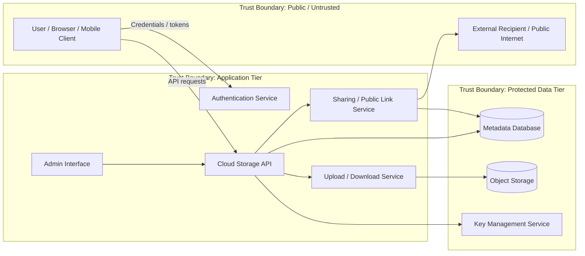
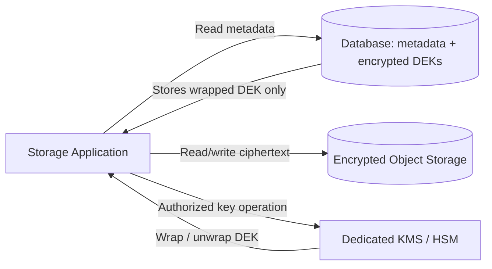

# Cloud Storage Service Threat Model

## System Overview

The cloud storage service provides the following functionality:

- File upload and download
- File sharing with other users
- Public link generation
- File versioning
- Client-side and server-side encryption options

The service processes highly sensitive assets, including user credentials, private files, file metadata, sharing permissions, encryption keys, authentication tokens, and historical file versions.

---

## 1. Attack Surface Mapping

### Architecture and Trust Boundaries



### Entry Points and Risk Ranking

| Rank | Entry Point | Risk | Why It Matters | Main Threats |
|---:|---|---|---|---|
| 1 | File upload endpoint | **Critical** | Accepts attacker-controlled content and can expose parsers, storage systems, malware scanners, and downstream users | Malicious file upload, parser exploitation, malware distribution, storage exhaustion |
| 2 | Authentication and session flows | **Critical** | Account takeover can expose all files and sharing capabilities associated with a user | Credential stuffing, MFA bypass, session hijacking, token theft |
| 3 | Public sharing links | **High** | Public URLs intentionally bypass normal account authentication and can leak sensitive data if predictable or misconfigured | Link guessing, unintended disclosure, stale links, excessive permissions |
| 4 | REST/API endpoints | **High** | APIs expose most storage, sharing, versioning, and account operations | Broken access control, IDOR/BOLA, injection, API abuse |
| 5 | File-sharing permissions | **High** | Incorrect authorization can expose private files to other authenticated users | Privilege escalation, unauthorized sharing, confused-deputy attacks |
| 6 | Encryption key handling | **High** | Compromise of encryption keys can convert encrypted storage into plaintext exposure | Key theft, key substitution, unauthorized decryption |
| 7 | Admin interface | **High** | Administrative functions can affect many users and override normal controls | Privilege escalation, admin account compromise, mass data access |
| 8 | File download endpoint | **Medium-High** | Download requests may be abused to access unauthorized files or exhaust bandwidth | IDOR/BOLA, path manipulation, bandwidth abuse |
| 9 | File versioning interface | **Medium** | Historical versions may contain deleted secrets or data users believe was removed | Information disclosure, rollback abuse, retention-policy bypass |
| 10 | Client applications / synchronization clients | **Medium** | Local tokens, cached files, and sync logic create additional attack paths | Token theft, insecure local storage, sync conflicts |
| 11 | Metadata/search functions | **Medium** | File names, ownership, tags, and access metadata can reveal sensitive information | Injection, metadata leakage, enumeration |
| 12 | Password reset / account recovery | **Medium-High** | Weak recovery controls can bypass otherwise strong authentication | Account takeover, social engineering, reset-token theft |

### Highest-Risk Entry Points

The most important entry points are the **file upload service**, **authentication flows**, **public sharing links**, and **general API endpoints**. These are internet-facing, frequently used, and directly interact with sensitive user-controlled data or authorization decisions.

---

## 2. Threat Modeling: Storing Encryption Keys in the Database

A developer proposes storing encryption keys in the same database that contains encrypted file metadata or references to encrypted content.

### Why This Is Problematic

Encryption is intended to reduce the impact of a data-storage breach. If encrypted data and the keys required to decrypt it are stored in the same security boundary, one database compromise may expose both at once.

This creates a **single point of compromise**: the attacker no longer needs to breach two independently protected systems.

A stronger design separates encrypted data from key material, typically by using a dedicated **Key Management Service (KMS)**, **Hardware Security Module (HSM)**, or another isolated key store with independent access controls and audit logging.

### STRIDE Threats Introduced

| STRIDE | Threat | Description | Attack Scenario | Impact | Likelihood | Specific Mitigation |
|---|---|---|---|---|---|---|
| **S – Spoofing** | Unauthorized key retrieval through stolen service identity | If the application uses the same database credentials for normal data and key retrieval, impersonating that service may grant access to both | An attacker steals an application service token and authenticates to the database as the storage backend | Decryption of user files and possible impersonation of trusted services | Medium | Use separate service identities, short-lived credentials, workload identity, and dedicated KMS permissions |
| **T – Tampering** | Encryption key substitution | Database write access could allow an attacker to replace keys or key references | An attacker with SQL write access replaces a user's key reference with an attacker-controlled key or corrupts key metadata | Data corruption, denial of access, possible malicious re-encryption | Medium | Store keys outside the database; enforce authenticated key wrapping, integrity checks, immutable audit logs, and strict write separation |
| **R – Repudiation** | Weak accountability for key access | If keys are read like ordinary rows, it may be difficult to prove who or what accessed them | A privileged insider queries encryption-key rows and later denies accessing sensitive files | Weak forensic evidence and regulatory exposure | Medium | Use KMS/HSM audit trails, per-service identity, centralized logging, and alerting on decryption operations |
| **I – Information Disclosure** | Database breach exposes ciphertext and keys | The same compromise exposes both protected data and the material needed to decrypt it | SQL injection, stolen DB credentials, or a malicious DBA dumps the database, including encryption keys | Large-scale plaintext disclosure of customer data | **High** | Keep keys in KMS/HSM, use envelope encryption, rotate keys, restrict decrypt permissions, and never store plaintext master keys in application tables |
| **D – Denial of Service** | Key deletion or corruption makes data unreadable | An attacker with database modification rights damages key records | Database compromise results in deletion of encryption-key rows or key identifiers | Users permanently lose access to encrypted files unless recoverable backups exist | Medium | Protect key material with versioning, backups, KMS durability, deletion protection, and dual-control recovery procedures |
| **E – Elevation of Privilege** | Database access becomes decryption authority | Database compromise unintentionally grants the ability to decrypt data that should require a separate security role | A low-level database administrator gains access to encrypted content simply because keys are stored in the same system | Collapse of separation of duties and broad unauthorized access | **High** | Separate DB and KMS roles, enforce least privilege, use independent IAM policies, and require explicit decrypt permission |

### Recommended Key Architecture



**Recommended model:**

1. Generate a unique Data Encryption Key (DEK) for files or logical data groups.
2. Encrypt the actual file using the DEK.
3. Encrypt (wrap) the DEK using a Key Encryption Key (KEK) held in a KMS/HSM.
4. Store only the **wrapped DEK** alongside file metadata.
5. Require an independently authorized KMS operation before decryption.
6. Log every sensitive key operation.

This preserves separation of duties and ensures a database-only breach does not automatically expose plaintext data.

---

## 3. Top Five Threats and Risk Matrix

### Risk Scoring Method

The requested matrix uses:

```text
Risk Score = Likelihood × Impact
```

Where both values are rated from **1 to 5**.

| Score | Risk Level |
|---:|---|
| 1–4 | Low |
| 5–9 | Medium |
| 10–16 | High |
| 17–25 | Critical |

### Risk Matrix

| # | Threat | Likelihood (1–5) | Impact (1–5) | Score | Risk Level |
|---:|---|---:|---:|---:|---|
| 1 | Broken access control / IDOR exposes another user's files | 4 | 5 | **20** | **Critical** |
| 2 | Account takeover through credential theft or session hijacking | 4 | 5 | **20** | **Critical** |
| 3 | Malicious file upload compromises backend processing or distributes malware | 4 | 4 | **16** | **High** |
| 4 | Public sharing link exposes confidential files | 4 | 4 | **16** | **High** |
| 5 | Encryption keys compromised together with the database | 3 | 5 | **15** | **High** |

---

## 4. Detailed Analysis of the Top Five Threats

### Threat 1 – Broken Access Control / IDOR

- **Description:** The API fails to verify that the authenticated user owns or is authorized to access a requested file object.
- **Attack scenario:** A user downloads `/api/files/12345`, modifies the identifier to `/api/files/12346`, and receives another user's private document because the backend checks authentication but not object ownership.
- **Impact:** Large-scale confidentiality breach, regulatory exposure, customer data leakage, and reputational damage.
- **Likelihood:** **4/5 – High.** Object-level authorization flaws are common in storage APIs because nearly every file operation requires authorization checks.
- **Mitigation:** Enforce server-side object-level authorization on every request; use non-sequential opaque identifiers; implement centralized authorization middleware; add automated negative authorization tests; log and rate-limit enumeration attempts.

### Threat 2 – Account Takeover

- **Description:** An attacker gains control of a legitimate user account through stolen credentials, phishing, credential stuffing, token theft, or session hijacking.
- **Attack scenario:** An attacker reuses credentials from a previous breach, logs into the cloud storage account, downloads private files, creates persistent public links, and shares files with attacker-controlled accounts.
- **Impact:** Complete compromise of the victim's stored files, sharing relationships, and account-level confidentiality.
- **Likelihood:** **4/5 – High.** Internet-facing authentication services are continuously targeted and password reuse remains common.
- **Mitigation:** Require MFA or passkeys, block known-compromised passwords, detect credential stuffing, use short-lived session tokens, revoke sessions after suspicious activity, and require step-up authentication for high-risk actions such as mass downloads or sharing changes.

### Threat 3 – Malicious File Upload

- **Description:** An attacker uploads a crafted or malicious file that exploits file-processing components or is later delivered to other users.
- **Attack scenario:** An attacker uploads a malformed image, archive, or document that exploits a vulnerable thumbnail generator or parser running in the backend, potentially gaining code execution within the processing environment.
- **Impact:** Backend compromise, malware propagation, unauthorized access to stored data, or service disruption.
- **Likelihood:** **4/5 – High.** Upload interfaces are intentionally exposed to untrusted content and often rely on complex third-party parsers.
- **Mitigation:** Process files in isolated sandboxed workers; enforce file-size and decompression limits; validate file signatures instead of only extensions; disable execution in upload directories; scan files asynchronously; patch parsers quickly; use allowlists for supported file types.

### Threat 4 – Public Sharing Link Disclosure

- **Description:** Public links may allow unauthorized access if they are predictable, overly permissive, long-lived, or accidentally distributed.
- **Attack scenario:** A user creates a permanent public link to a sensitive document. The link is forwarded externally or discovered in browser history, logs, analytics, or referrer headers, allowing unauthorized users to download the file.
- **Impact:** Confidential information disclosure and possible regulatory or contractual violations.
- **Likelihood:** **4/5 – High.** Public links are designed for frictionless access and therefore intentionally bypass part of the normal authentication boundary.
- **Mitigation:** Use high-entropy tokens; support expiration and password protection; default to short lifetimes for sensitive content; allow immediate revocation; prevent tokens from appearing in logs; show clear warnings for public access; monitor unusual download activity.

### Threat 5 – Encryption Key and Database Co-Compromise

- **Description:** Encryption keys are stored in the same database as protected data or metadata, eliminating effective separation between ciphertext and decryption authority.
- **Attack scenario:** An attacker exploits SQL injection or steals database credentials, exports encrypted records and encryption keys, and decrypts sensitive files offline.
- **Impact:** Mass plaintext disclosure, defeat of encryption-at-rest protections, regulatory consequences, and loss of customer trust.
- **Likelihood:** **3/5 – Medium.** A direct database compromise is less frequent than account abuse, but storing keys there dramatically increases the consequence when it occurs.
- **Mitigation:** Use a dedicated KMS/HSM, envelope encryption, isolated IAM roles, automatic key rotation, per-key authorization policies, and detailed key-usage auditing.

---

## 5. DREAD Prioritization

To comply with the project threat-modeling methodology, the same five threats are also scored using DREAD.

### DREAD Formula

```text
DREAD Score = (Damage + Reproducibility + Exploitability + Affected Users + Discoverability) / 5
```

Each factor is rated from **1 to 10**.

| Threat | Damage | Reproducibility | Exploitability | Affected Users | Discoverability | Calculation | DREAD |
|---|---:|---:|---:|---:|---:|---|---:|
| Broken access control / IDOR | 10 | 9 | 8 | 9 | 8 | (10+9+8+9+8)/5 | **8.8** |
| Account takeover | 9 | 8 | 8 | 7 | 9 | (9+8+8+7+9)/5 | **8.2** |
| Malicious file upload | 9 | 8 | 7 | 9 | 8 | (9+8+7+9+8)/5 | **8.2** |
| Public sharing link disclosure | 8 | 9 | 8 | 7 | 8 | (8+9+8+7+8)/5 | **8.0** |
| Encryption key + DB compromise | 10 | 8 | 6 | 10 | 6 | (10+8+6+10+6)/5 | **8.0** |

### DREAD Reasoning

#### 1. Broken Access Control / IDOR – 8.8/10

- **Damage (10):** Can expose arbitrary private files.
- **Reproducibility (9):** Once the pattern is known, requests are easy to repeat.
- **Exploitability (8):** Often requires only manipulating object identifiers or API parameters.
- **Affected Users (9):** A systemic authorization flaw can affect a large part of the user base.
- **Discoverability (8):** File IDs and API requests are visible during normal client interaction.

#### 2. Account Takeover – 8.2/10

- **Damage (9):** Attacker can act as the victim and access stored files.
- **Reproducibility (8):** Credential attacks can be automated at scale.
- **Exploitability (8):** Phishing and password reuse make attacks practical.
- **Affected Users (7):** Usually affects individual accounts, but campaigns can target many users.
- **Discoverability (9):** Authentication endpoints are obvious and publicly accessible.

#### 3. Malicious File Upload – 8.2/10

- **Damage (9):** Successful parser exploitation may compromise backend systems.
- **Reproducibility (8):** A working exploit can usually be uploaded repeatedly.
- **Exploitability (7):** Exploitation may require a vulnerable file parser and crafted payload.
- **Affected Users (9):** Backend compromise can affect many tenants.
- **Discoverability (8):** Upload functionality is a core and obvious feature.

#### 4. Public Sharing Link Disclosure – 8.0/10

- **Damage (8):** Sensitive files can become publicly accessible.
- **Reproducibility (9):** Anyone possessing the link may repeatedly access the resource.
- **Exploitability (8):** Exploitation may require only obtaining or guessing a URL.
- **Affected Users (7):** Exposure often begins with individual links but can scale through misuse.
- **Discoverability (8):** Public-link functionality is visible to users and attackers with accounts.

#### 5. Encryption Key + Database Compromise – 8.0/10

- **Damage (10):** Encryption protection may be defeated for all affected data.
- **Reproducibility (8):** Once database access is obtained, extraction is repeatable.
- **Exploitability (6):** Requires meaningful database compromise or privileged access.
- **Affected Users (10):** Shared key-storage design can affect the entire service.
- **Discoverability (6):** Internal key-storage architecture may not be externally visible.

---

## 6. Prioritized Mitigation Plan

| Priority | Action | Reason | Practical Constraint |
|---:|---|---|---|
| 1 | Centralize object-level authorization checks | Directly addresses the highest DREAD and matrix risk | Requires API refactoring and regression testing |
| 2 | Strengthen account security with MFA/passkeys and anomaly detection | Reduces a highly probable attack path | User adoption and support overhead |
| 3 | Isolate file-processing workers and harden upload validation | Limits both exploitation and malware distribution | Additional compute and sandboxing cost |
| 4 | Move keys to KMS/HSM with envelope encryption | Preserves encryption value during DB compromise | Cloud KMS cost and migration complexity |
| 5 | Harden public sharing links | Reduces accidental and deliberate data exposure | Must balance usability with security |

For a resource-constrained team, the first implementation phase should prioritize **authorization**, **authentication**, and **upload isolation**, because these controls address the most likely internet-facing attack paths. Key-management migration should follow immediately if keys are currently stored alongside protected data, because the current design defeats the intended security boundary of encryption at rest.

---

## Conclusion

The cloud storage service has a large attack surface because it combines untrusted file handling, public sharing, authentication, APIs, and encryption. The highest risks are broken access control, account takeover, malicious uploads, public-link exposure, and weak key management.

The most serious architectural issue is storing encryption keys in the same database as encrypted data. This collapses two security layers into one and introduces major **Information Disclosure**, **Tampering**, **Elevation of Privilege**, and related STRIDE risks. A dedicated KMS/HSM with envelope encryption and independent authorization should therefore be treated as a core security requirement rather than an optional improvement.
